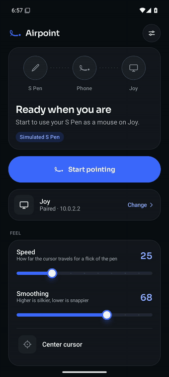
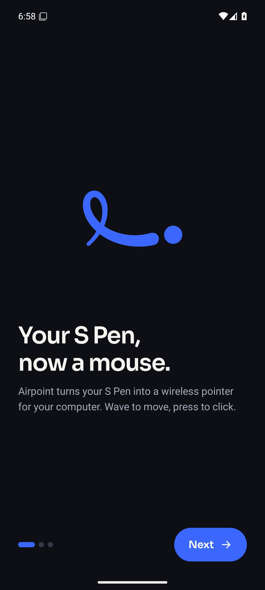
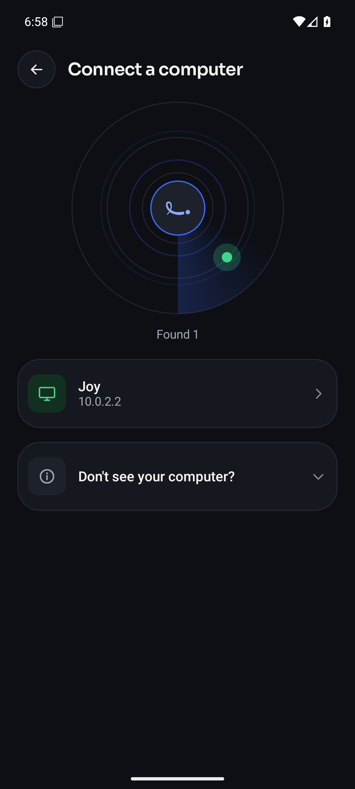
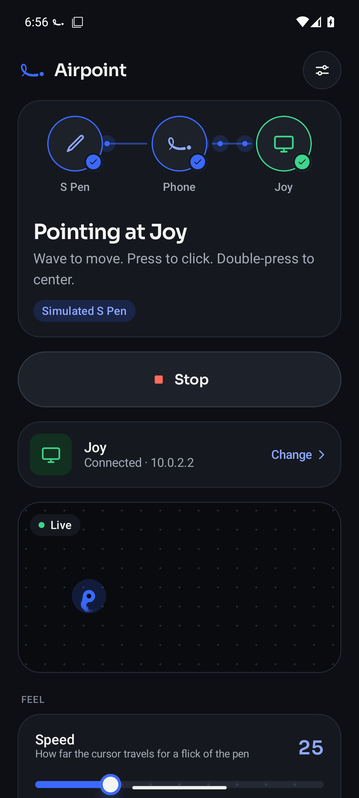
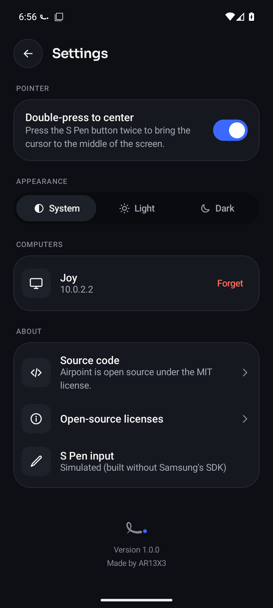

<p align="center">
  
</p>

<h1 align="center">Airpoint</h1>

<p align="center"><b>Your S Pen, now a mouse. A free, open-source air pointer for Galaxy devices and Windows PCs.</b></p>

<p align="center">
  <a href="docs/GUIDE.md"><b>User guide</b></a> ·
  <a href="docs/DESIGN.md">Design</a> ·
  <a href="docs/PROTOCOL.md">Protocol</a> ·
  <a href="CONTRIBUTING.md">Contributing</a> ·
  <a href="#license">License</a>
</p>

<p align="center">
  
</p>

Airpoint turns the Bluetooth S Pen of a Galaxy phone or tablet into a wireless pointer for
your computer. Wave the pen to move the cursor, press its button to click, hold the button
to drag, and double-press to bring the cursor back to the middle of the screen. It works
for presentations from across the room, a couch-to-TV PC, or just because it's fun.

Two small apps make it work. The **Android app** reads the pen and streams its motion over
your Wi-Fi. The **Windows app** lives in the system tray and moves the cursor. They find each
other automatically and pair once with a PIN.

## Screenshots

| Welcome | Find your PC | Paired | Pointing | Settings |
| --- | --- | --- | --- | --- |
|  |  |  |  |  |

## Quick start

You need a Galaxy phone or tablet whose S Pen supports **Air actions** (Bluetooth), on
Android 12 or later, and a Windows 10 or 11 PC on the same network.

1. **On the PC,** run `Airpoint.exe`. When Windows Firewall asks, allow it on **private
   networks**. A loop icon appears in the system tray.
2. **On the phone,** install Airpoint and open it. The short welcome asks for two
   permissions: Nearby devices (for the pen) and Notifications.
3. Tap **Start pointing**. Your PC shows up on the radar. Tap it and type the 6-digit PIN
   from the tray icon on the PC.
4. Wave the pen. That's it. Next time, just tap Start.

The **[user guide](docs/GUIDE.md)** covers every control, the tray menu and
troubleshooting.

Prebuilt downloads will be on the [Releases](https://github.com/AR13X3/airpoint/releases)
page. Until then, building takes a few minutes (see below).

## Features

**Pointing that feels right**
- Smooth, low-latency cursor motion. The phone batches pen motion every 12 ms, and the PC
  eases it at 200 Hz with sub-pixel accuracy.
- Click, drag (hold the button), and double-press to recenter.
- Edge scrolling: keep pushing past the top or bottom of the screen to scroll, or past the
  sides to scroll sideways.
- Speed and smoothing sliders that apply instantly while you point.

**Zero-config connection**
- Finds your PC on the network automatically, with no IP addresses to type (manual entry
  is still there).
- Reconnects on its own if Wi-Fi drops, and finds the PC again if its IP address changed.
- Keeps working in the background, with Center and Stop in the notification.

**Secure by default**
- One-time PIN pairing, then per-phone tokens (only their hashes are stored on the PC).
- PIN guessing is throttled with exponential lockouts. Browsers are refused outright.
- Forget a phone from the tray at any time. See [the security model](docs/PROTOCOL.md#3-security-model).

**Designed with care**
- A complete design system: color tokens tested for WCAG AA in light and dark, Sora for
  display type, a custom icon set and spring-based motion.
- A live link stage driven by real pen motion, a mirrored pointer pad, a discovery radar
  and a tactile PIN entry, with haptics throughout.
- Respects *Remove animations*, TalkBack and dynamic text. The full rationale is in
  [DESIGN.md](docs/DESIGN.md).

## How it works

```
 S Pen ──Bluetooth──▶ Android app ──Wi-Fi (WebSocket)──▶ Windows tray app ──▶ cursor
          Samsung S Pen          JSON over ws://            200 Hz easing
          Remote SDK             port 8765                  loop (pynput)
```

1. **Pen to phone.** Samsung's S Pen Remote SDK delivers button events and air-motion
   deltas to a foreground service.
2. **Phone to PC.** Deltas are scaled by your speed setting, coalesced and sent over a
   WebSocket. Clicks go out immediately. Phones find PCs with a UDP broadcast.
3. **PC to cursor.** The desktop app authenticates the phone, queues motion, and drains it
   into the cursor with easing, so bursty Wi-Fi still looks smooth.

The wire format, pairing handshake and security model are specified in
[PROTOCOL.md](docs/PROTOCOL.md).

## Build from source

**Windows app** (Python 3.11+):

```bash
cd desktop
python -m venv .venv
.venv\Scripts\pip install -r requirements-dev.txt
.venv\Scripts\python -m airpoint            # run from source (tray)
.venv\Scripts\pyinstaller airpoint.spec      # build dist\Airpoint.exe
```

**Android app** (Android Studio or JDK 17+):

1. Download Samsung's [S Pen Remote SDK](https://developer.samsung.com/galaxy-spen-remote)
   and copy its two jars into `android/app/libs/`. The SDK is proprietary, so it isn't in
   this repository ([details](android/app/libs/README.md)).
2. Build:

```bash
cd android
./gradlew assembleDebug
```

Without the SDK jars, the app builds with a **simulated S Pen** that traces a slow
figure-eight, so you can work on the UI on any device or emulator.

## Project structure

```
android/        Android app (Kotlin, Jetpack Compose)
desktop/        Windows tray app (Python)
docs/           User guide, design system, protocol
tools/brand/    Generators for the logo, icons and animations
assets/         Brand artwork, screenshots and demo
```

## Contributing

Bug reports, ideas and pull requests are welcome. Please read [CONTRIBUTING.md](CONTRIBUTING.md)
first. It covers setup, the design guidelines and the project's conventions.

## License

Airpoint is free and open-source software under the **[MIT License](LICENSE)**.
Copyright © 2026 AR13X3.

Third-party components and their licenses are listed in
[THIRD_PARTY_NOTICES.md](THIRD_PARTY_NOTICES.md). Samsung's S Pen Remote SDK is not
included in this repository and is subject to Samsung's own terms.

S Pen and Galaxy are trademarks of Samsung Electronics. Airpoint is an independent project
and is not affiliated with or endorsed by Samsung.

## Credits

Designed and built by [AR13X3](https://github.com/AR13X3), with the help of
[Claude Code](https://claude.com/claude-code).

- [Sora](https://github.com/sora-xor/sora-font) typeface by the Sora Project Authors (SIL OFL 1.1)
- [OkHttp](https://square.github.io/okhttp/), [websockets](https://websockets.readthedocs.io/),
  [pynput](https://github.com/moses-palmer/pynput), [pystray](https://github.com/moses-palmer/pystray)
  and [Pillow](https://python-pillow.org/)
